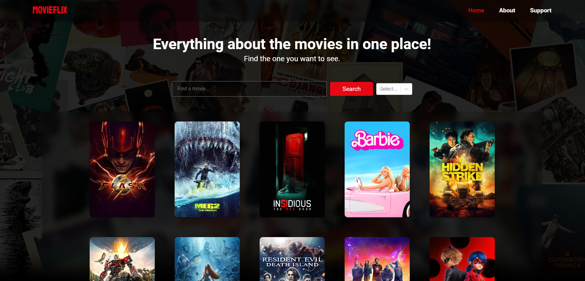

# MOVIEFLIX App

The MOVIEFLIX App is a web application that allows users to search for movies, view movie details, and watch trailers.



## Table of Contents

- [Features](#features)
- [Technologies Used](#technologies-used)
- [Installation](#installation)
- [Getting Started](#getting-started)
- [Usage](#usage)
- [Contributing](#contributing)
- [Contact](#contact)

## Features

- Search for movies by title
- Filter movies by genre
- View detailed information about each movie
- Watch official trailers of selected movies

## Technologies Used

- React: A JavaScript library for building user interfaces
- React Router: For handling navigation within the app
- Axios: For making HTTP requests to the movie API
- React Query: For data fetching and caching
- React YouTube: For embedding YouTube trailers
- CSS: For styling the app
- The Movie Database (TMDb) API: For fetching movie data

## Installation

1. Clone this repository to your local machine using:

   ```bash
   git clone https://github.com/your-username/movieflix-app.git
   ```

## Getting Started

To run the MOVIEFLIX app locally, follow these steps:

1. Navigate to the project directory: `cd the-movie-db`
2. Install dependencies: `npm install`
3. Start the development server: `npm run dev`
4. Open your browser and go to: `http://localhost:3000`

## Usage

1. Open the app in your browser.
2. Use the search bar to find movies by title.
3. Filter movies by selecting genres from the dropdown.
4. Click on a movie card to view detailed information.

## Contributing

To contribute to MOVIEFLIX, follow these steps:

1. Fork the repository.
2. Create a new branch: `git checkout -b feature/your-feature-name`
3. Make your changes and commit them: `git commit -m "Add your changes"`
4. Push to your forked repository: `git push origin feature/your-feature-name`
5. Open a pull request against the `main` branch.

## Contact

If you have any questions or feedback, feel free to reach out:

- Email: nikolajovanovic.cr99@gmail.com
- GitHub: [NikJov99](https://github.com/NikJov99)
